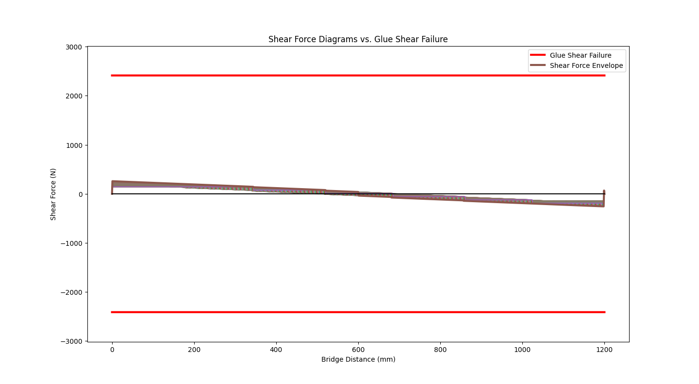
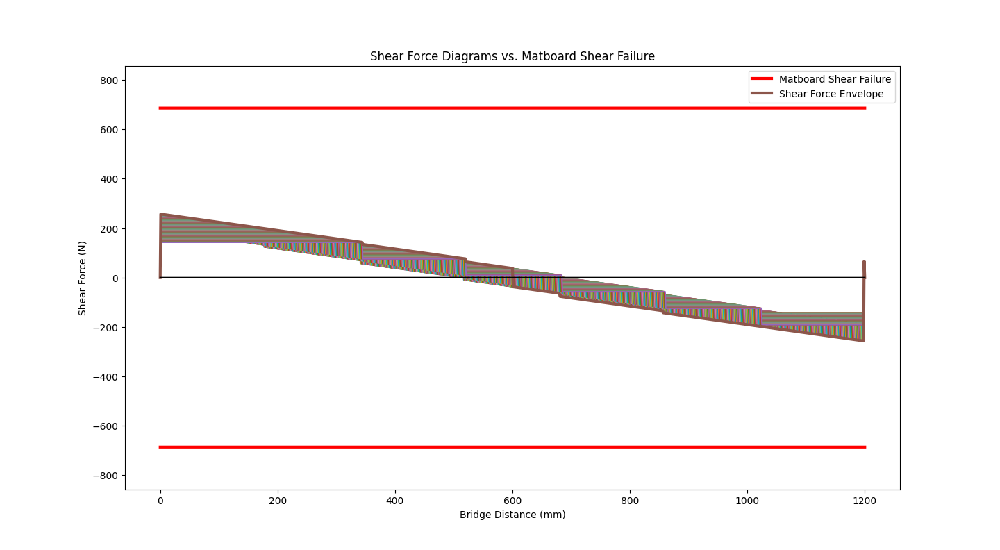
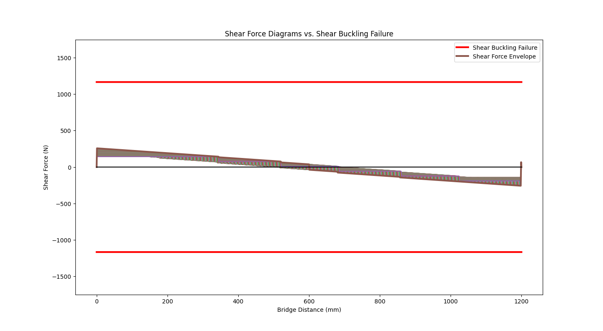
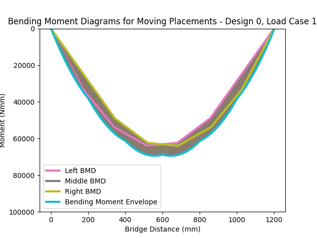
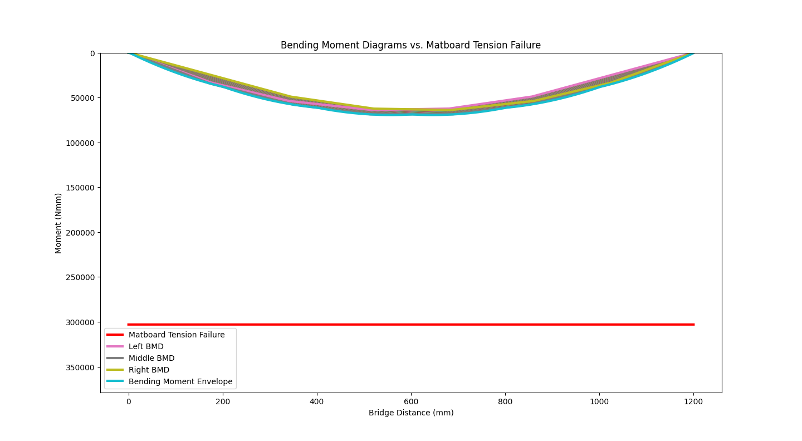
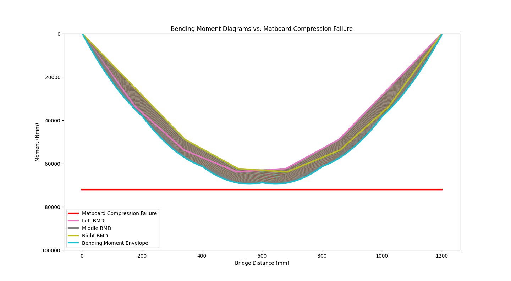
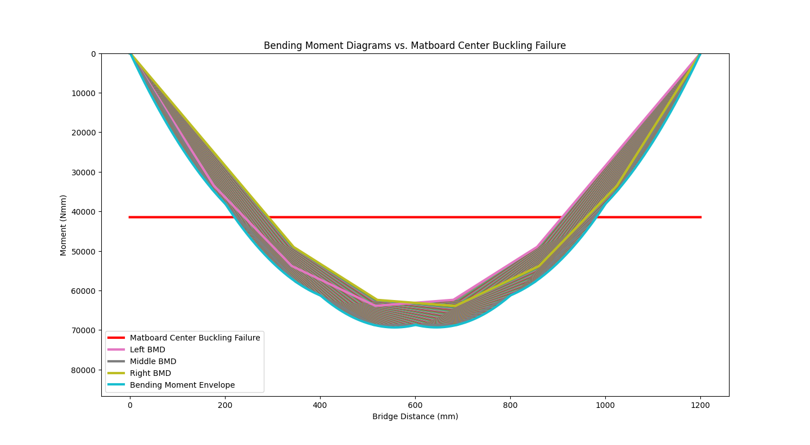
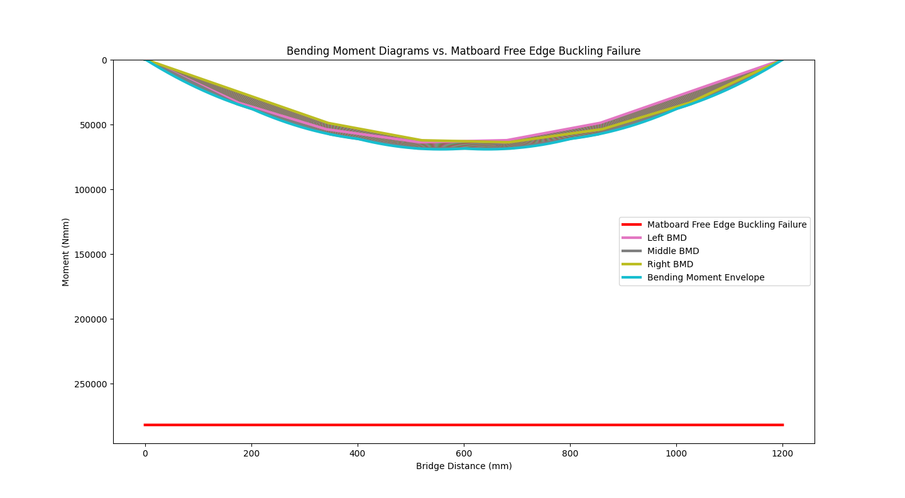
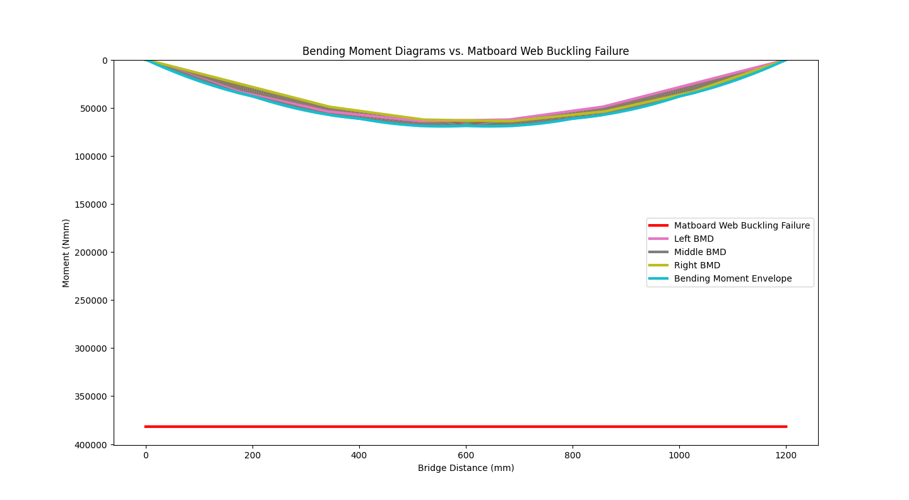

# Beam Bridge Analyzer 

This project automates the calculations for a beam bridge of any cross section carrying 
a train of known load. The project was designed to eliminate the amount of time spent on 
hand calculations to focus on optimizing the cross section of the bridge to carry higher loads. 

Using Shear Force Diagrams and Bending Moment Diagrams generated by the program for all 
1200 possible train locations (the bridge is 1200 mm in length), the program analyzes: 

- Compressive Stress 
- Tensile Stress 
- Thin Plate Buckling (multiple modes)
- Shear Stress of Bridge and Glue
- Factors of Safety (based on material properties)
- Theoretical Method of Failure 

# Visuals 

The project uses several Python libraries to visually represent each possible mode of 
failure for the bridge. The following graphs are for a 400 N train. 

## Shear Force Diagrams

## Bending Moment Diagrams

# Instructions for Use 

To obtain the factors of safety based on the bending moment diagram and shear force 
diagram, run **main.py**. 

To obtain graphical representations of the bridge capacities, run **capacities.py**.